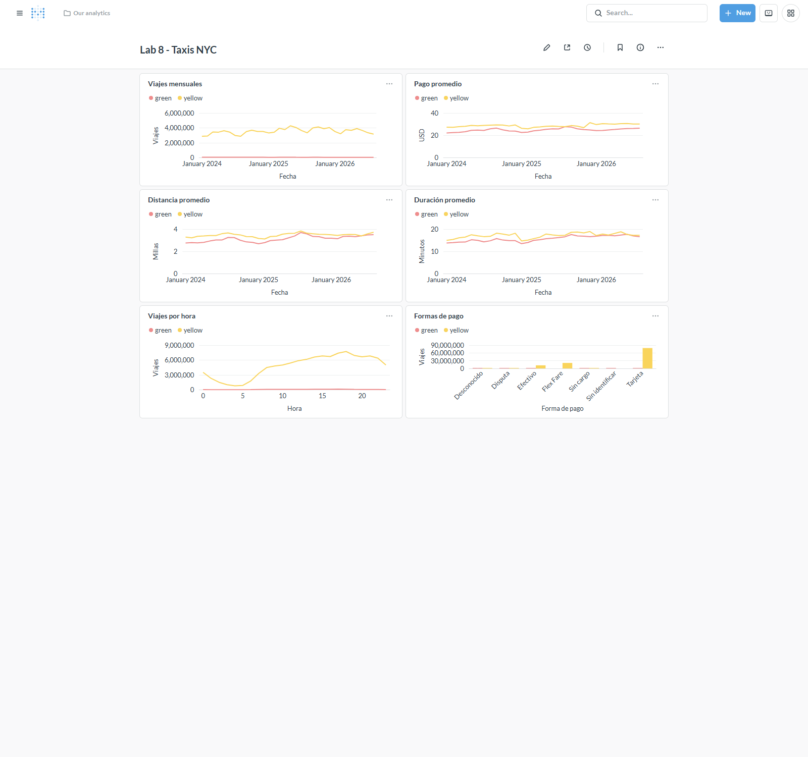

# Lab 8 - DuckDB

## 1. Ambiente

Fork: https://github.com/Ninaswiftie09/duckdb. Repositorio de Erick: https://github.com/menene/duckdb.

JupyterLab y Metabase responden correctamente. El ambiente incluye Python, DuckDB, Pandas, PyArrow, Matplotlib y Requests. Las versiones fijas permiten repetir el análisis con las mismas herramientas.

## 2. Descarga inicial

Contiene 16 archivos y 30,040,469 registros de los meses publicados. Todos los enlaces publicados tienen un Parquet local válido. Los archivos existentes permanecen sin cambios.

El descargador acepta varios años, identifica los meses publicados y omite archivos existentes. Cada descarga incluye tamaño, cantidad de registros y una huella SHA-256.

## 3. Exploración y calidad

El conjunto completo contiene 64 archivos y 121,184,384 registros.

| Taxi | Año | Archivos | Registros |
| --- | --- | --- | --- |
| Verdes | 2024 | 12 | 660,218 |
| Verdes | 2025 | 12 | 591,375 |
| Verdes | 2026 | 8 | 337,114 |
| Amarillos | 2024 | 12 | 41,169,720 |
| Amarillos | 2025 | 12 | 48,722,602 |
| Amarillos | 2026 | 8 | 29,703,355 |

Las 25 columnas incluyen fechas de inicio y fin, pasajeros, distancia, zonas, forma de pago, tarifa, propina y recargos. Las fechas son TIMESTAMP, los importes y distancias son DOUBLE, los códigos son INTEGER o BIGINT y las cadenas son VARCHAR.

La muestra contiene fechas fuera del periodo del archivo. También hay distancias y duraciones no positivas, pagos no positivos y pasajeros faltantes.

Los indicadores incluyen fechas dentro del mes de origen, distancias mayores que 0 y hasta 100 millas, duración mayor que 0 y hasta 180 minutos y pagos mayores que 0 y hasta 500 USD. Los pasajeros faltantes permanecen sin imputación.

Consultar Parquet directamente permite filtrar y agrupar datos sin importarlos primero a una tabla ni cargar todo el conjunto en memoria.

## 4. Preguntas y hallazgos

| Pregunta | Indicador | Motivo |
| --- | --- | --- |
| ¿Cómo cambia la cantidad de viajes por mes? | Viajes mensuales | Cambios en la actividad. |
| ¿Qué tipo de taxi registra más viajes? | Cantidad por tipo | Diferencia de volumen. |
| ¿Cuál es la hora con más viajes? | Viajes por hora | Horarios de mayor actividad. |
| ¿Cuánto cuesta un viaje? | Pago promedio | Costo para el pasajero. |
| ¿Qué distancias recorren los taxis? | Distancia promedio | Tamaño de los recorridos. |
| ¿Cuánto dura un viaje? | Duración promedio | Tiempo de traslado. |
| ¿Qué forma de pago es más frecuente? | Viajes por forma de pago | Uso de formas de pago. |
| ¿Cuánto representa la propina con tarjeta? | Porcentaje de propina | Relación entre propina y tarifa. |
| ¿Qué zonas tienen más salidas? | Viajes por zona | Concentración de viajes. |
| ¿Qué tan altos son los pagos y distancias? | Mediana y percentil 95 | Diferencia entre valores habituales y altos. |
| ¿Cuántos registros tienen datos inconsistentes? | Cantidad por problema | Calidad de los datos. |
| ¿Cómo cambian los indicadores entre años? | Comparación de los mismos meses | Evolución del servicio. |

Amarillos: mayor actividad a las 18:00, con 7,725,998 viajes. El mes con más viajes es 2025-05, con 4,283,501. La zona de salida más frecuente es 237, con 5,153,451 viajes.

Verdes: mayor actividad a las 17:00, con 121,523 viajes. El mes con más viajes es 2024-05, con 57,428. La zona de salida más frecuente es 74, con 376,372 viajes.

Los taxis amarillos acumulan 75.28 veces más registros que los verdes.

Las fechas fuera del mes del archivo suman 1,290 registros. Los datos de pasajeros faltantes suman 23,542,797.

## 5. Incorporación de 2024

2024 aporta 24 archivos y 41,829,938 registros. La cobertura conjunta de 2024 y 2026 es de 40 archivos. Las huellas de los 16 archivos anteriores coinciden y las consultas funcionan con ambos años.

Los años como parámetros y la unión de columnas por nombre permiten agregar datos sin cambiar las consultas.

## 6. Benchmark

Datos de 2024 y 2026. Tres repeticiones por consulta, después de un calentamiento, con cuatro hilos y 2 GB de memoria. Los tiempos corresponden a las medianas en segundos y los resultados coinciden entre ambas fuentes.

| Archivos | Consulta | Parquet (s) | DuckDB (s) |
| --- | --- | --- | --- |
| 2 | Horarios | 0.25 | 0.10 |
| 2 | Mensual | 0.35 | 0.21 |
| 2 | Pagos | 0.31 | 0.10 |
| 12 | Horarios | 1.70 | 0.59 |
| 12 | Mensual | 2.18 | 1.25 |
| 12 | Pagos | 2.08 | 0.78 |
| 40 | Horarios | 5.43 | 2.13 |
| 40 | Mensual | 8.32 | 3.20 |
| 40 | Pagos | 7.05 | 2.90 |

Tiempo de creación de las tablas:

| Archivos | Segundos |
| --- | --- |
| 2 | 9.25 |
| 12 | 26.02 |
| 40 | 75.20 |

La tabla responde más rápido en las nueve comparaciones. Los tiempos aumentan con el volumen. Parquet permite consultas ocasionales sin una carga previa. La tabla resulta útil para consultas repetidas, aunque requiere tiempo de creación y espacio adicional.

## 7. Indicadores y tablero

El tablero contiene viajes mensuales, pago promedio, distancia promedio, duración promedio, viajes por hora y formas de pago. Estos indicadores resumen actividad, costo y características de los recorridos.

| Taxi | Viajes | Pago (USD) | Distancia (millas) | Duración (min) | Tarjeta (%) |
| --- | --- | --- | --- | --- | --- |
| Amarillos | 113,898,370 | 28.71 | 3.47 | 17.23 | 69.32 |
| Verdes | 1,503,848 | 24.76 | 3.12 | 15.62 | 68.19 |

Los amarillos tienen mayor volumen, pago y duración promedio. La tarjeta es la forma de pago más frecuente en ambos tipos. Las horas de mayor actividad son las 18:00 para amarillos y las 17:00 para verdes.

Propina con tarjeta como porcentaje de la tarifa:

| Año | Amarillos (%) | Verdes (%) |
| --- | --- | --- |
| 2024 | 25.17 | 22.37 |
| 2025 | 25.48 | 22.50 |
| 2026 | 25.10 | 22.95 |

## 8. Comparación entre años

2025 aporta 24 archivos. La comparación corresponde a los meses presentes en los tres años.

| Taxi | Año | Viajes | Pago (USD) | Distancia (millas) | Duración (min) |
| --- | --- | --- | --- | --- | --- |
| Verdes | 2024 | 416,816 | 23.73 | 2.91 | 14.42 |
| Verdes | 2025 | 374,777 | 24.84 | 3.10 | 15.28 |
| Verdes | 2026 | 322,429 | 25.40 | 3.35 | 17.10 |
| Amarillos | 2024 | 25,569,452 | 28.24 | 3.42 | 16.38 |
| Amarillos | 2025 | 29,792,621 | 27.44 | 3.45 | 16.49 |
| Amarillos | 2026 | 28,230,818 | 30.23 | 3.52 | 17.66 |

Amarillos, de 2024 a 2026: viajes +10.41%, pago promedio +7.05% y distancia promedio +2.86%.

Verdes, de 2024 a 2026: viajes -22.64%, pago promedio +7.04% y distancia promedio +14.87%.

Los viajes verdes disminuyen en los tres años. Los amarillos alcanzan su mayor volumen en 2025. El pago y la distancia promedio de 2026 superan los de 2024 en ambos tipos. El recargo de congestión aparece desde 2025.

## 9. Discusión

### 9.1 Características útiles

Lectura directa de Parquet, SQL y unión de columnas por nombre permiten analizar varios años sin una importación previa.

### 9.2 Parquet

Permite trabajar con los archivos originales sin otra copia. Las diferencias de columnas requieren una unión por nombre y las consultas repetidas vuelven a leer los datos.

### 9.3 Tablas DuckDB

Las consultas repetidas tienen menores tiempos. La tabla requiere espacio adicional, tiempo de creación y actualización al agregar datos.

### 9.4 Comparación con Pandas

DuckDB filtra y agrupa antes de pasar resultados a Pandas. Esto reduce la cantidad de datos en memoria.

### 9.5 Incorporación de datos

Los años como parámetros, los nombres mensuales y las vistas comunes permiten incorporar archivos nuevos con pocos cambios.

### 9.6 Automatización en producción

Descarga mensual, validación de datos y actualización de la base y el tablero.

### 9.7 Reproducibilidad

Versiones fijas, código y SQL versionados, filtros documentados y datos originales separados de Git.

### 9.8 Aprendizaje

El volumen hace visibles los costos de lectura, memoria y almacenamiento. Las diferencias de columnas y fechas requieren atención al combinar años.

## Fuente

[NYC TLC Trip Record Data](https://www.nyc.gov/site/tlc/about/tlc-trip-record-data.page)
